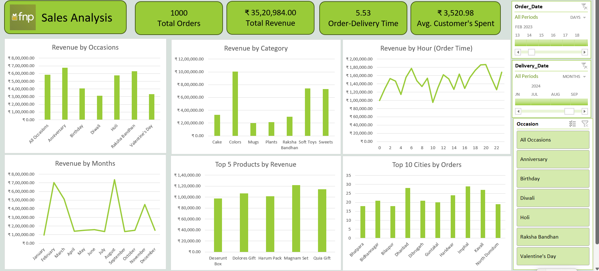

# 📊 Sales Analysis in Excel

This repository contains a sales performance dashboard created for FNP. The dashboard provides key insights into orders, revenue, customer behavior, and product trends to support data-driven decision-making.

🔑 Key Metrics

Total Orders: 1000

Total Revenue: ₹35,20,984

Average Order-Delivery Time: 5.53 days

Average Customer Spend: ₹3,520.98

📌 Dashboard Visuals & Insights
1️⃣ Revenue by Occasions

This chart shows revenue distribution across occasions such as Anniversary, Birthday, Holi, Raksha Bandhan, and Valentine’s Day.

Highest revenue: Anniversary & Raksha Bandhan

Lowest revenue: Diwali

2️⃣ Revenue by Category

Revenue segmented by product categories including Cakes, Colors, Mugs, Plants, Soft Toys, and Sweets.

Colors and Soft Toys drive the most revenue.

Mugs and Plants contribute the least.

3️⃣ Revenue by Hour (Order Time)

This line chart shows when customers place orders during the day.

Peak ordering hours: 4 AM, 7 AM, and 7–8 PM.

Suggests customers prefer early morning and evening orders.

4️⃣ Revenue by Months

Revenue trend across months.

March & September show revenue peaks.

Sales dip during April–June and November.

5️⃣ Top 5 Products by Revenue

The top-performing products are listed.

Best seller: Dolores Gift & Magnam Set.

Consistent performers: Deserunt Box, Harum Pack, Quia Gift.

6️⃣ Top 10 Cities by Orders

Breakdown of order volumes across cities.

Dhanbad, Imphal, and Kayali have the highest orders.

Smaller but notable contributors include Bhatpara, Bilaspur, Haridwar.

⚙️ Filters Available

The dashboard includes interactive filters to refine insights:

Order Date (day-wise)

Delivery Date (month-wise)

Occasion filter (Anniversary, Birthday, Holi, etc.)

🚀 How to Use

Explore the dashboard visuals.

Analyze sales distribution across occasions, categories, and time.

Apply filters to view customized insights.
